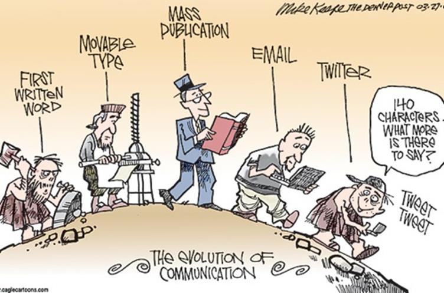
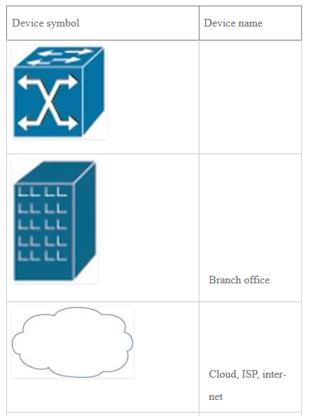
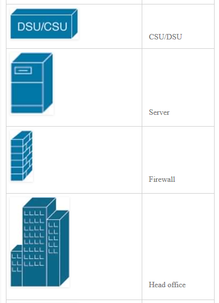
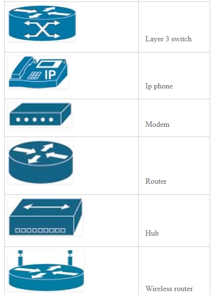
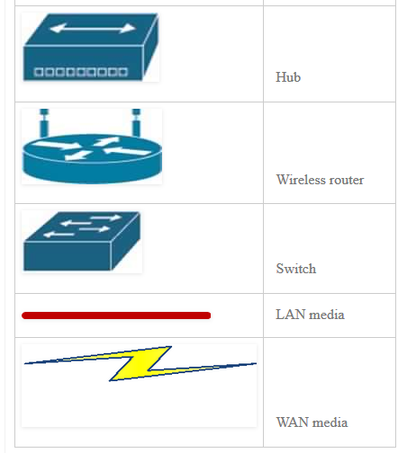

# El mundo de las redes

## Introducción
Las comunicaciones han evolucionado enormemente. Los métodos tradicionales de comuniación tales como el correo han sido superados por formas más sofisticadas. Los métodos de comunicación electrónico ofrecen mayor velocidad, eficiencia, confiabilidad, integridad, seguridad; escalan en áreas geográficas mayores y requieren menos recursos para su uso. Herramientas y servicios tales como email, blogs, podcasts, mensajaría instantánea y redes sociales entre otros métodos multimedias han cambiado la manera en que nos comunicamos en gran medida.

En este capítulo, daremos una visión del mundo de las redes: discutiremos los siguientes puntos:

1. El rol de las redes en nuestras vidas
2. Explicar las cualidades y elementos de una red
3. Definición de términos claves y diagramas usados en este curso
4. Explicar que es una red convergente
5. Dar una breve reseña de las redes de computadoras

Este capítulo es crucial dado que alguno de los conceptos a aprender serán útiles para entender el resto del curso.

### El rol de las redes
La necesidad de comunicar es una necesidad humana. La comunicación ha estado evolucionando a lo largo de los años, desde el tallado en rocas a las formas más complejas. El siguiente diagrama es una descripción adecuada de esta evolución.

Los métodos de comunicación modernos son el resultado de la evolución de las redes de computadoras. Desde que el primer email fue enviado en 1965, la comunicación ha recorrido un largo camino.

Ya no estamos restringidos a la comunicación cara a cara. Con internet el mundo se ha vuelto más interconectado de lo que estuvo antes.

Las redes de computadoras no solo son responsables de la comunicación, sino que de toda nuestra forma de vida a evolucionado. La manera en que trabajamos, interactuamos, entre otras formas han cambiado significativamente.

Algunas de las formas en las que usamos las redes de computadoras incluyen:

* Negocios -banca online, email, e-commerce
* Entretenimiento - películas online, juegos online
* Interacción social - mensajería instantánea, sitios de redes sociales

Claramente, por lo tanto, las redes juegan un papel central en nuestras vidas.

### Elementos de una red
Para comprender redes necesitamos entender los elementos de una red. Existe cuatro elementos principales que definen cómo la comunicación funciona a través de las redes.

* Reglas o acuerdos que gobiernan cómo los mensajes son enviados, direccionados, recibidos e interpretados - ejemplos incluyen protocolos.
* Los mensajes o unidades de información que viajan desde un dispositivo a otros - Estos pueden ser packets, frames entre otros.
* Un medio para interconectar estos dispositivos - un medio que puede transportar estos mensajes de un dispositivo a otro - tal como los cables de cobre, fibra óptica entre otros.
* Dispositivos en la red que intercambian mensajes unos con otros - Estos pueden incluir ip de teléfonos, computadores, servidores, routers entre otros.

En este curso, usaremos muchos dispositivos de redes, a partir de estos, crearemos topologías simples y complejas, basado en los requisitos. Recuerda esto porque ellos serán usados a través de este curso así cómo los exámenes. Estos son mostrados a continuación.

Estos son algunos iconos que serán usados en este curso. 

### Redes Convergentes
El mundo de las redes ha crecido a lo largo de los años. Estamos encontrando más y más formas de usar redes de computadoras. La comuniación sobre redes no solo se limita a la transmisión de datos estático, aplicaciones bastantes nuevas como teleconferencias, video, noticias y otras aplicaciones multimedias pueden ser encontradas en las redes de computadoras.

Años atrás, la comunicación fue segmentada. Por lo que Había diferentes redes para cada aplicación.

* Para voz, habían redes telefónicas.
* Para video, existian proveedores de TV y cable.
* Para datos estaban los proveedores de internet.

Sin embargo, todos estos servicios pueden ser provistos sobre la misma red y esto se ha atribuido al crecimiento de la redes informáticas. Por lo tanto, una red convergente es una en la cuál todos estos servicios; datos, voz y audio, son provistos sobre la misma red.

Esto esencialmente elimina la necesidad de múltiples proveedores para cada uno de estos servicios.

### Otros Conceptos
Tolerancia a fallas y escalabilidad - Esto significa que las redes deberían poder recuperarse del tiempo de inactividad u otras fallas y deberían poder ampliarse según sea necesario.

Calidad de servicio - Estos es una medida estandarizada en redes para garantizar que los servicios proporcionados en una red convergente funcionen de manera óptima. Por ejemplo, la comunicación sería deficiente  si una red solo tuviera video y no audio cuando un ejecutivo de negocios está en una videoconferencia. Para asegurar la calidad de servicio, diferentes servicios tienen diferentes prioridades.

Seguridad - La red debe estar a salvo de intrusiones por acceso no autorizado. Esto garantizaría que la comunicación sea efectiva y se mantenga la confidencialidad, integridad y disponibilidad de la información.

### Resumen
Este capítulo introductorio está destinado a ayudarte a comprender la importancia de la comunicación sobre las redes. Estos conceptos, serán cruciales para entender este curso. Aprenderemos los fundamentos de las comunicaciones a través de las redes. En el siguiente capítulo, veremos cómo funciona la comunicación utilizando modelos estratificados y aprenderemos algunos concepto más.
