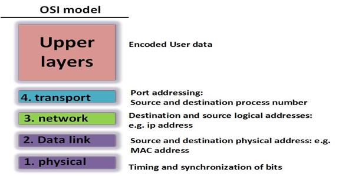

# TCP/IP y el modelo OSI

### Visión
En el capítulo previo nos presentarón las redes de computadoras y llegamos a conocer su importancia en la vida cotidiana. En este capítulo, veremos los modelos estratificados que se utilizan en la comunicación a través de redes.

Discutiremos el modelo TCP/IP y el modelo OSI para comprender mejor como es que trabaja la comunicación. Esto conducirá a un debate detallado sobre cada una de las capas a fin de comprenderlas mejor.

### Uso del modelo estratificado(capas)
Para comprender mejor los varios protocolos y como ellos trabajan unos con otros, usamos el modelo de capas. Un modelo de capas muestra como los protocolos funcionan en cada capa, así como también las capas interactúan con la capa superior o inferior a ellas. Los modelos de capas que son usados hoy en las redes de computadoras modernas son dos: El modelo OSI (Open Systems Interconnection) y el modelo TCP/IP (Transmission Control Protocol / Internet Protocol)

El uso de los modelos OSI y TCP/IP presenta varios beneficios al explicar cómo funcionan los protocolos de red y estos incluyen los siguiente.

* Cada capa en un modelo define un protocolo diferente, por lo tanto al usar un modelo de capas, ingenieros en redes pueden ser capaz de definir y diseñar protocolos que se ajustan a la capa específica.
* Aumenta la competición entre diferentes vendedores, esto porque los modelos definen estándares y, por lo tanto, la superioridad del producto no se basa en el uso de ciertos protocolos, ya que todos los productos los respaldan.
* El modelo en capas es útil ya que permite la independencia entre otras capas. Esto significa que si se realiza un cambio en la tecnología o las capacidades de una capa, no afectará a otra capa que este ni por encima ni por debajo.
* Dado que el modelo de capas es un estándar abierto, proporciona conformidad e interoperabilidad entre diferentes dispositivos de red.

Como mencione inicialmente, los dos modelos que serán discutidos en este curso son el modelo OSI y el TCP/IP. Sin embargo, estos dos modelos son diferentes.

El modelo TCP/IP es un modelo de protocolo y describe las funciones en cada una de sus capas. Los protocolos que se definen en este modelo generalmente se basan en las especificaciones del proveedor. Sin embargo, el modelo TCP/IP es un estándar abierto y por lo tanto ninguna compañía tiene el control sobre sus definiciones. Los protocolos y definiciones en TCP/IP, son mantenidos en un registro público resguardado por el IETF (Internet Engineering Task Force) y ellos son conocidos como RFCs (Request for Comments). El modelo TCP/IP fue introducido en el año 1970 por el US's DOD (Departamento de Defensa).

El modelo OSI es un modelo de referencia y se utiliza para proporcionar o mantener la coherencia y la estandarización entre los diversos protocolos y servicios que se utilizan en las redes. Esto no da una regulación estricta sobre cómo o qué protocolos y servicios deberían trabajar en cada capa, sino que funciona como una guía. Una buena analogía seria un comité que regula las contrucciones de una ciudad, este organismo estaría a cargo de las regulaciones sobre dónde una persona puede colocar una estructura, las especificaciones de resistencia, la altura máxima y otras regulaciones, sin embargo, no puede prescribir el diseño específico del edificio que se colocorá. El modelo de referencia tiene como objetivo proporcionar una comprensión clara de lo que sucede, las funciones y procesos en cada capa, sin embargo, no dice exactamente cómo deberían implementarse.

Los modelos OSI y TCP/IP son mostrados a continuación, sin embargo, el modelo OSI es el modelo más comúnmente usado en redes hoy en día. Los ingenieros en redes lo usan para el diseño, operación y solución de problemas de equipos de red cuando es necesario. Esto no significa que el modelo TCP/IP no sea relevante, como veremos a medida que avancemos en el curso.

### Modelo TCP/IP
Este modelo fue introducido en 1970. Hay cuatro categorías como se puede ver en la imagen anterior. Las comunicaciones a través de la red se definieron primero utilizando este modelo y para que la comunicación fuera exitosa, las funciones de cada capa deben estar en su lugar en una red. A partir de la imagen a continuación podrás ver la función de todas y cada una de las capas de este modelo.

La capa de aplicación, es el componente que interactúa con el usuario, cuando estás usando un navegador web, este es un componente de capa de aplicación.

La capa de transporte define los distintos puertos y ayuda a diferenciar los diferentes tipos de comunicación de un único usuario. Tú puedes estar enviando un email, navegando y escuchando la radio por internet en un sólo computador. Este es el trabajo de la capa de transporte, diferenciar los distintos tipos de comunicación. La capa de transporte también ayuda en la interoperabilidad entre diferentes dispositivos de red, como un PDA y una computadora.

La capa de internet esta diseñada para proporcionar la mejor ruta a las redes remotas, esto diferencia los diferentes dispositivos de una red. Si un mensaje es enviado de una computadora a otra en una red remota, el trabajo de la capa de internet es asegurarse que el mensaje llegue al destinatario deseado. Puedes comparar la capa de internet con la dirección que usas cuando envias una carta.

La capa de acceso a la red actúa como una interfaz entre los componentes de hardware y software de una red. Las capas de aplicación, transporte e internet son todas implementadas por software, sin embargo, la capa red de acceso a internet traduce los mensajes de estas capas a una forma que pueda ser transmitida sobre distintos medios cómo cables de fibra óptica, cables de cobre e inalámbricamente.

Los protocolos que son definidos en el modelo TCP/IP describen las distintas funciones y procesos de cada capa. Esto significa que los protocolos en cada capa deben tener funciones específicas como se describe en el modelo TCP/IP.

Por ejemplo si queremos enviar un email, los pasos que se muestran a continuación serían las funciones de cada capa para esta comunicación.

1. En la capa de aplicación, creamos el correo electrónico y esta sería la información que se comunicaría a través de la red.
2. La capa de transporte dividirá estos datos en segmentos y agregaría información en un proceso conocido como encapsulación.

    **Nota: La encapsulación es un proceso de adición de información específica de protocolo, así como la conversión de una unidad de datos de protocolo (PDU) en una forma que se adapata a la capa en la que se encuentra. En este caso, la PDU en la capa de transporte es el segmento.**

3. Los segmentos se pasarian luego a la capa de internet y se encapsularían en paquetes, en esta capa, se agregaría el direccionamiento lógico. (Más sobre el direccionamiento lógico se discutirá más adelante)
4. Los paquestes son pasados luego a la capa de acceso a la red, la capa de acceso a la red prepararía los paquetes para la transmisión a través de los medios físicos, como el cable de fibra óptica, convirtiendo los datos en señales luminosas.
5. Cuando los datos se reciben en el destino, ocurriría el proceso inverso, es decir, la eliminación de la información específica del protocolo -Se llevaría a cabo la desencapsulación y el reensamblaje de los datos en la aplicación.
6. La información es pasada al usuario. Este proceso es ilustrado a continuación.

Como se mencionó anteriormente, cada forma que toman los datos en cada capa del modelo TCP/IP se conoce como PDU, ya hemos discutido el transporte y las PDU de la capa de internet. La lista a continuación muestra cada uno de los PDU's en las diferentes capas del modelo TCP/IP.

1. Data -La información del usuario final, esto puede incluir, contenido del correo eletrónico, información del sitio web, entre otros. Esta es la información presentada al usuario.
2. Segemento -Como se mencionó anteriormente, este es el PDU en la capa de transporte.
3. Paquete -En la capa de internet, los paquetes son los PDU's e incluyen el direccionamiento lógico para la entrega remota.
4. Frame -Esta es la forma que toma la información en la capa de acceso a la red, también hay un direccionamiento en esta capa, que es el direccionamiento físico, como la dirección MAC.
5. Bits -La forma que transportan los medios físicos son los Bits, estos pueden estar en muchas formas, cómo señales electricas, señales de luz entre otras.

### Modelo OSI
El modelo OSI provee una lista extendida de funciones y servicios que pueden ocurrir en cada capa. También describe la interacción de cada capa con las capas directamente encima y debajo de ella.

### Comparación de los modelos TCP/IP y OSI
Los protocolos que se discuten en el modelo TCP/IP, pueden ser claramente definidos y descritos en el modelo OSI. En este modelo, como se muestra en la imagen anterior, las capas de aplicación y acceso a la red se dividen para definir más funciones. La capa de aplicación se divide en las capas de aplicación, presentación y sesión, mientras que la capa de acceso a la red se divide en la capa de enlace de datos y la capa física.

El modelo OSI muestra funciones más detalladas de cada una estas capas a diferencia del modelo TCP/IP. En las capas de enlace de datos y físico, el modelo OSI sólo describe cómo se manejan los datos desde la capa de red a la capa física. No dice qué sucede exactamente en cada uno de ellos.

Las capas de red y transporte del modelo OSI son muy similares a las del modelo TCP/IP. Las funciones en estas capas son las mismas.

La capa de transporte define cómo se produce la comunicación entre las diferentes máquinas de usuario. En esta capa, las reglas definen cómo se reconocen los mensajes, cómo se recupera la comunicación de los errores y cómo se organizan los segmentos. En el modelo OSI, los protocolos que principalmente funcionan aquí son los protocolos UDP y TCP. Veremos estos en futuros temas.

###PDUs y comunicación sobre un modelo en capas.
El modelo OSI define cómo se codifican, formatean, encapsulan y segmentan los mensajes para que puedan transmitirse a través de las redes. Como mencionamos anteriormente, los datos generalmente se dividen en diferentes PDU y las capas en el modelo OSI definen cómo se controla cada PDU para que la comunicación sea exitosa.

Las direcciones son una de las formas en que la comunicación se realiza con éxito en la red. Si podemos usar la analogía de la oficina postal, puede imaginarse lo difícil que sería, sino imposible, enviar cartas sin una dirección de destino o lo difícil que sería si el destinatario no supiera a quién responder. El siguiente diagrama muestra las diversas direcciones que se utilizan en la comuniación a través de la red.

El uso de cada tipo de dirección se discutirá en capítulos posteriores. Las PDU definen el tipo de datos en cada capa de este modelo.

**NOTA: El proceso de transmitir información a través de la red es guiado por los modelos de referencia TCP/IP y OSI, por lo tanto, tu no deberías ignorar estos conceptos ya que ellos son cruciales para comprender la comunicación a través de la red**

### Resumen
En este capítulo, discutimos cómo la comunicación funciona sobre el modelo de capas. Hemos analizado los modelos de referencias TCP/IP y OSI, y cómo definen la comunicación en cada capa. También hemos visto las unidades de datos de protocolo y comparado los dos modelos. En el siguiente capítulo, veremos la capa de aplicación.